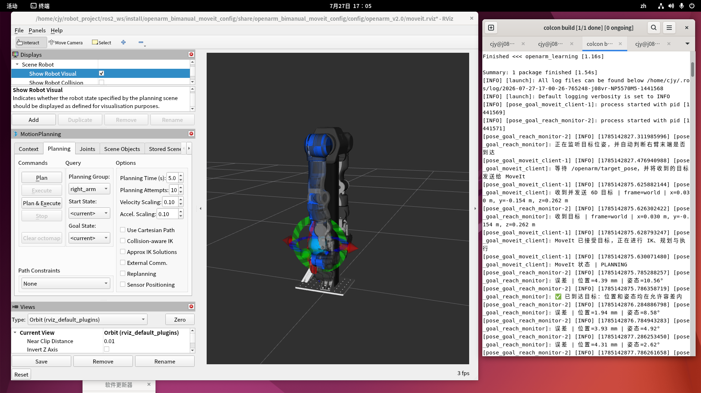
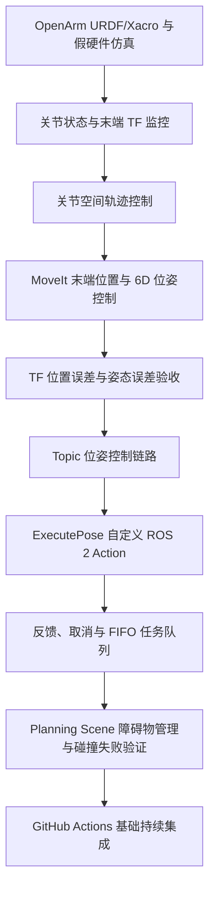
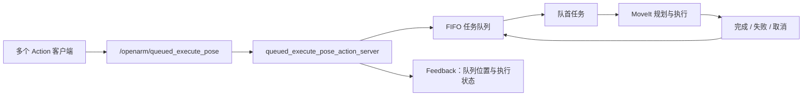

# OpenArm ROS 2：右臂 6D 位姿控制、任务队列与闭环验收

> 一个基于 ROS 2 Humble、OpenArm、MoveIt 2 和 ros2_control 的机械臂仿真控制项目。  
> 项目完成了右臂末端 6D 位姿控制、MoveIt 逆运动学与轨迹规划、TF 闭环到达判定、Planning Scene 碰撞场景管理，以及支持 FIFO 队列和取消的自定义 ROS 2 Action。



---

## 1. 项目目标

本项目用于学习并验证一条完整的 ROS 2 机械臂控制链路：

```text
末端 6D 位姿目标
    ↓
ROS 2 Topic 或自定义 Action
    ↓
MoveIt 2：逆运动学、碰撞检查与轨迹规划
    ↓
ros2_control 轨迹控制器
    ↓
OpenArm 假硬件与 RViz 仿真
    ↓
TF 获取实际末端位姿
    ↓
位置与姿态误差闭环验收
```

项目重点不是只让机械臂“动起来”，而是理解并实现：

- 上层如何描述机械臂末端目标；
- MoveIt 如何将末端目标转换为关节轨迹；
- ROS 2 Action 如何提供任务反馈、队列和取消；
- TF 如何用于执行后的位姿验收；
- 碰撞物体如何进入 MoveIt 规划场景；
- 规划失败、取消和成功如何被正确返回给调用方。

---

## 2. 学习与实现路径

项目按以下顺序完成：



---

## 3. 已完成能力

- 使用 OpenArm v2.0 的 URDF/Xacro 模型搭建双臂仿真环境。
- 在 `use_fake_hardware:=true` 的 `mock_components/GenericSystem` 假硬件环境中运行。
- 支持右臂 7 关节关节空间轨迹控制。
- 支持右臂末端完整 6D 位姿目标：
  - 位置：`x, y, z`
  - 朝向四元数：`qx, qy, qz, qw`
- 通过 MoveIt 2 完成：
  - 逆运动学求解；
  - 碰撞检测；
  - 轨迹规划；
  - 控制器执行。
- 通过 TF 查询：

  ```text
  world → openarm_right_ee_base_link
  ```

  获取右臂末端实际位姿。

- 自动计算目标位姿与实际末端位姿之间的位置误差和姿态误差。
- 实现基于阈值的目标到达判定。
- 实现 Topic 形式的末端位姿控制接口。
- 定义自定义 ROS 2 Action：

  ```text
  openarm_interfaces/action/ExecutePose
  ```

- 支持普通单任务执行。
- 支持最多 5 条任务的 FIFO 队列调度。
- 支持 Action 实时反馈。
- 支持执行中取消任务。
- 支持向 MoveIt Planning Scene 添加和删除虚拟碰撞盒。
- 已验证碰撞物体会导致冲突规划失败，Action 返回失败结果。
- 已配置 GitHub Actions，用于基础 ROS 2 构建和接口检查。

---

## 4. 系统架构

### 4.1 普通 6D 位姿 Action 执行链路


### 4.2 FIFO 队列执行链路



---

## 5. 软件环境

| 项目 | 当前环境 |
|---|---|
| 操作系统 | Ubuntu 22.04 |
| ROS 2 | Humble |
| 机器人模型 | OpenArm v2.0 |
| 运动规划 | MoveIt 2 |
| 控制框架 | ros2_control |
| 硬件模式 | `mock_components/GenericSystem` 假硬件 |
| 可视化 | RViz 2 |
| Python | Python 3.10 |
| 远程图形桌面 | NoMachine |
| 代码管理 | Git / GitHub |
| 持续集成 | GitHub Actions |

> 当前项目仅验证软件控制链路与假硬件仿真，未连接真实 CAN 总线、驱动器或真实 OpenArm 机械臂。

---

## 6. 仓库结构

```text
openarm-ros2-pose-control/
├── .github/
│   └── workflows/
│       └── ros2-ci.yml
├── docs/
│   └── rviz_pose_control.png
├── packages/
│   ├── openarm_interfaces/
│   │   ├── action/
│   │   │   └── ExecutePose.action
│   │   ├── msg/
│   │   ├── CMakeLists.txt
│   │   └── package.xml
│   └── openarm_learning/
│       ├── launch/
│       │   ├── right_arm_pose_demo.launch.py
│       │   ├── topic_pose_control.launch.py
│       │   └── queued_pose_control.launch.py
│       ├── openarm_learning/
│       │   ├── joint_state_monitor.py
│       │   ├── end_effector_monitor.py
│       │   ├── right_arm_trajectory_client.py
│       │   ├── moveit_position_client.py
│       │   ├── moveit_pose_client.py
│       │   ├── pose_goal_moveit_client.py
│       │   ├── pose_goal_reach_monitor.py
│       │   ├── planning_scene_obstacle.py
│       │   ├── execute_pose_action_server.py
│       │   └── queued_execute_pose_action_server.py
│       ├── package.xml
│       ├── setup.py
│       └── setup.cfg
├── .gitignore
└── README.md
```

---

## 7. 编译项目

```bash
cd ~/robot_project/ros2_ws

source /opt/ros/humble/setup.bash

colcon build --packages-select \
  openarm_interfaces \
  openarm_learning \
  --symlink-install

source install/setup.bash
```

验证软件包和自定义 Action：

```bash
ros2 pkg prefix openarm_interfaces
ros2 pkg prefix openarm_learning

ros2 interface show \
  openarm_interfaces/action/ExecutePose
```

---

## 8. 启动 OpenArm MoveIt 假硬件仿真

```bash
cd ~/robot_project/ros2_ws

source /opt/ros/humble/setup.bash
source install/setup.bash

ros2 launch openarm_bimanual_moveit_config demo.launch.py \
  arm_type:=openarm_v2.0 \
  use_fake_hardware:=true
```

启动后可以在 RViz 中：

1. 选择 `right_arm` 规划组；
2. 设置目标关节姿态或末端目标；
3. 点击 `Plan`；
4. 查看规划轨迹；
5. 点击 `Execute` 或 `Plan & Execute` 执行。

---

## 9. 两种控制方式

### 9.1 关节空间控制

关节空间控制直接指定右臂 7 个关节目标角度：

```text
joint1, joint2, joint3, joint4, joint5, joint6, joint7
```

控制链路：

```text
目标关节角度
    ↓
FollowJointTrajectory
    ↓
right_joint_trajectory_controller
    ↓
ros2_control 假硬件
```

对应节点：

```text
right_arm_trajectory_client.py
```

适用于已知每个关节目标角度的场景。

### 9.2 末端 6D 位姿控制

末端控制直接描述机械臂末端应到达的位置和朝向：

```text
x, y, z, qx, qy, qz, qw
```

MoveIt 自动完成：

```text
末端目标位姿
    ↓
IK：求解右臂关节角度
    ↓
碰撞检测与约束检查
    ↓
轨迹规划
    ↓
控制器执行
```

对应节点：

```text
moveit_position_client.py
moveit_pose_client.py
pose_goal_moveit_client.py
```

这种方式更适合上层应用：调用方只需说明“末端要去哪里”，由 MoveIt 决定“机械臂各关节如何运动”。

---

## 10. 自定义 ExecutePose Action

项目定义了自定义 ROS 2 Action：

```text
openarm_interfaces/action/ExecutePose
```

接口定义：

```text
# Goal：调用者发送的完整末端 6D 位姿目标。
geometry_msgs/PoseStamped target_pose
---
# Result：任务结束后返回的结果。
bool success
int32 error_code
string message
---
# Feedback：执行过程中的实时反馈。
uint32 queue_position
string state
```

字段说明：

| 字段 | 含义 |
|---|---|
| `target_pose` | 目标末端完整 6D 位姿 |
| `success` | 是否成功完成任务 |
| `error_code` | MoveIt 或任务执行错误码 |
| `message` | 结果说明 |
| `queue_position` | 任务在队列中的位置 |
| `state` | 当前任务状态 |

---

## 11. 普通 6D 位姿任务执行

启动普通 Action 服务端：

```bash
cd ~/robot_project/ros2_ws

source /opt/ros/humble/setup.bash
source install/setup.bash

ros2 run openarm_learning execute_pose_action_server
```

新开终端，发送一条右臂末端目标：

```bash
source /opt/ros/humble/setup.bash
source ~/robot_project/ros2_ws/install/setup.bash

ros2 action send_goal --feedback \
  /openarm/execute_pose \
  openarm_interfaces/action/ExecutePose \
  "{target_pose: {header: {frame_id: 'world'}, pose: {position: {x: 0.030, y: -0.154, z: 0.262}, orientation: {x: 0.0, y: 0.0, z: 0.0, w: 1.0}}}}"
```

正常反馈示例：

```text
state: BUILDING_MOVEIT_GOAL
state: WAITING_MOVEIT_ACCEPTANCE
state: PLANNING_AND_EXECUTING

Result:
  success: true
  error_code: 1
  message: MoveIt 已成功规划并执行 6D 位姿任务

Goal finished with status: SUCCEEDED
```

---

## 12. FIFO 任务队列

项目实现了最多容纳 5 条任务的 FIFO 队列服务端。

启动队列 Action 服务端：

```bash
cd ~/robot_project/ros2_ws

source /opt/ros/humble/setup.bash
source install/setup.bash

ros2 run openarm_learning queued_execute_pose_action_server
```

队列 Action 名称：

```text
/openarm/queued_execute_pose
```

后进入队列的任务会收到：

```text
queue_position: 1
state: QUEUED_WAITING_FOR_TURN
```

轮到任务执行时：

```text
queue_position: 0
state: PLANNING_AND_EXECUTING
```

调度逻辑：

```text
任务 1 正在执行
任务 2 等待
任务 3 等待
    ↓
任务 1 结束
    ↓
任务 2 自动开始
    ↓
任务 2 结束
    ↓
任务 3 自动开始
```

---

## 13. Action 取消

ROS 2 Humble 的命令行工具未直接提供 `ros2 action cancel` 子命令，因此通过 Action 隐藏取消服务调用取消请求。

取消当前活动的队列任务：

```bash
source /opt/ros/humble/setup.bash
source ~/robot_project/ros2_ws/install/setup.bash

ros2 service call \
  /openarm/queued_execute_pose/_action/cancel_goal \
  action_msgs/srv/CancelGoal \
  "{goal_info: {goal_id: {uuid: [0, 0, 0, 0, 0, 0, 0, 0, 0, 0, 0, 0, 0, 0, 0, 0]}, stamp: {sec: 0, nanosec: 0}}}"
```

取消成功后的客户端结果示例：

```text
state: CANCELING_MOVEIT_TRAJECTORY

Result:
  success: false
  error_code: -2
  message: 任务已由调用者取消

Goal finished with status: CANCELED
```

---

## 14. TF 闭环到达判定

项目通过 TF 获取右臂末端实际位姿：

```text
world → openarm_right_ee_base_link
```

查询末端实际位姿：

```bash
source /opt/ros/humble/setup.bash
source ~/robot_project/ros2_ws/install/setup.bash

ros2 run tf2_ros tf2_echo \
  world \
  openarm_right_ee_base_link
```

输出示例：

```text
Translation: [0.028, -0.158, 0.265]

Rotation: in Quaternion (xyzw)
[-0.042, -0.025, -0.027, 0.998]

Rotation: in RPY (degree)
[-4.729, -3.015, -2.930]
```

| 数据 | 含义 | 单位 |
|---|---|---|
| `Translation x/y/z` | 末端位置 | 米 |
| `Quaternion x/y/z/w` | 末端朝向四元数 | 无单位 |
| `RPY` | 欧拉角形式的末端朝向 | 度或弧度 |

自动到达判定节点：

```text
pose_goal_reach_monitor.py
```

当前到达阈值：

| 指标 | 阈值 |
|---|---:|
| 位置误差 | `≤ 0.005 m`，即 5 mm |
| 姿态误差 | `≤ 0.26 rad`，约 14.9° |

一次已完成的测试结果：

```text
目标位置：x=0.030 m，y=-0.154 m，z=0.262 m
位置误差：4.98 mm
姿态误差：6.38°
判定结果：已到达目标
```

---

## 15. Topic 位姿控制链路

项目还实现了基于 Topic 的末端位姿控制接口：

```text
/openarm/target_pose
```

消息类型：

```text
geometry_msgs/msg/PoseStamped
```

启动“话题目标 → MoveIt 执行 → TF 验收”链路：

```bash
cd ~/robot_project/ros2_ws

source /opt/ros/humble/setup.bash
source install/setup.bash

ros2 launch openarm_learning topic_pose_control.launch.py
```

发布一条末端 6D 位姿目标：

```bash
source /opt/ros/humble/setup.bash
source ~/robot_project/ros2_ws/install/setup.bash

ros2 topic pub --once \
  /openarm/target_pose \
  geometry_msgs/msg/PoseStamped \
  "{header: {frame_id: 'world'}, pose: {position: {x: 0.030, y: -0.154, z: 0.262}, orientation: {x: 0.0, y: 0.0, z: 0.0, w: 1.0}}}"
```

---

## 16. Planning Scene 与碰撞场景

项目使用 `planning_scene_obstacle.py` 调用 MoveIt 的服务：

```text
/apply_planning_scene
```

向规划场景添加或删除名为 `demo_box` 的虚拟碰撞盒。

添加障碍物：

```bash
source /opt/ros/humble/setup.bash
source ~/robot_project/ros2_ws/install/setup.bash

ros2 run openarm_learning planning_scene_obstacle --ros-args \
  -p x:=0.060 \
  -p y:=-0.154 \
  -p z:=0.262 \
  -p size_x:=0.040 \
  -p size_y:=0.040 \
  -p size_z:=0.040
```

删除障碍物：

```bash
ros2 run openarm_learning planning_scene_obstacle --ros-args \
  -p remove:=true
```

查询规划场景中是否存在 `demo_box`：

```bash
ros2 service call /get_planning_scene \
  moveit_msgs/srv/GetPlanningScene \
  "{components: {components: 1023}}" \
  | grep -A 20 -B 2 "demo_box"
```

当前已验证：

- MoveIt 能接收并保存虚拟障碍物；
- RViz 的 `Scene Objects` 中可以显示 `demo_box`；
- 当目标或可行轨迹与障碍物冲突时，MoveIt 会拒绝规划；
- 自定义 Action 会返回失败状态；
- 不会向控制器发送潜在碰撞轨迹；
- 当障碍物不影响当前规划时，MoveIt 可以继续生成并执行轨迹。

> 当前已完成“规划场景更新”和“碰撞导致的规划失败”验证。  
> 严格验证“有障碍物时自动绕开并到达同一目标点”，需要基于完整机械臂各连杆扫掠区域设计障碍物位置，并对比有无障碍物时的完整轨迹；当前不将其表述为已完成能力。

---

## 17. GitHub Actions 持续集成

仓库包含 GitHub Actions 工作流：

```text
.github/workflows/ros2-ci.yml
```

持续集成用于验证：

- ROS 2 Humble 环境是否能够正常构建；
- `openarm_interfaces` 是否可成功构建；
- `ExecutePose.action` 是否可被识别；
- Python 节点是否通过基础语法检查；
- ROS 2 包结构是否符合当前组织方式。

每次推送到 GitHub 后，可在仓库顶部的 **Actions** 页面查看构建状态。

---

## 18. 项目成果总结

本项目完成了从高层末端目标到机械臂执行、再到 TF 闭环验收的完整控制流程：

```text
末端 6D 位姿目标
    ↓
ROS 2 Topic 或自定义 Action
    ↓
FIFO 队列与取消管理
    ↓
MoveIt 逆运动学、碰撞检测与轨迹规划
    ↓
ros2_control 控制器执行
    ↓
OpenArm 假硬件与 RViz 可视化
    ↓
TF 获取实际末端位姿
    ↓
位置与姿态误差自动验收
```

通过该项目掌握并实践了：

- ROS 2 软件包与工作空间管理；
- URDF/Xacro 机器人模型使用；
- MoveIt 2 逆运动学、碰撞检测和轨迹规划；
- ros2_control 轨迹控制器链路；
- TF 坐标变换与末端位姿监控；
- 四元数、RPY 与 6D 位姿表达；
- ROS 2 Topic、Service、Action 通信；
- Action 反馈、FIFO 队列和取消；
- Planning Scene 碰撞物体管理；
- Git、GitHub 与 GitHub Actions 基础持续集成。

---

## 19. 项目局限

- 当前使用 `mock_components/GenericSystem` 假硬件，不控制真实机械臂。
- 尚未接入 CAN 总线、电机驱动器、真实传感器和急停安全链路。
- 当前已验证碰撞场景能阻止冲突规划，但未完成严格的“绕障到达同一目标”对比实验。
- 当前任务队列采用 FIFO 策略，尚未实现优先级、超时和重试策略。
- 当前目标输入来自命令行、Topic 或 Action，尚未接入视觉语言模型等高层决策模块。

---

## 20. 后续方向

1. 完成严格的绕障轨迹对比实验，验证障碍物影响下的替代可行轨迹。
2. 为任务队列增加优先级、超时、重试和失败恢复策略。
3. 增加更多单元测试和集成测试，完善持续集成覆盖范围。
4. 支持动态障碍物更新与规划场景实时刷新。
5. 将视觉语言模型输出转换为安全的 OpenArm 位姿任务。
6. 在完成仿真和安全验证后，探索真实 OpenArm 硬件与 CAN 通信接入。